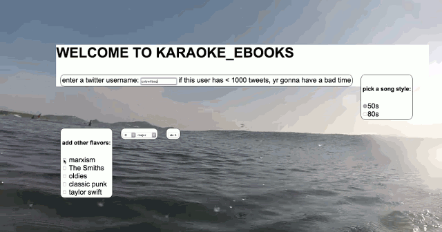

# KARAOKE EBOOKS

twitter fueled markov generated karaoke music.



this code is atrocious. i'm not sorry about that.

/audioSrc is basically a fork of [probability sequencer](http://www.github.com/coleww/problumz) which I have now deprecated in favor of https://github.com/coleww/overtone-live-coding so have fun with that one! all the procedural seed data is in /songs

/rhymeSrc contains the custom mrkv implementation and rhyme construction algorithm

/server is the thing that grabs all the tweets and caches them on a lil heroku thing *nice*

### development

```
npm install
node server.js
# modify `var host` in index.js to point to localhost :/
npm run watch
# serve the /www dir
```
